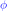
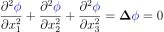
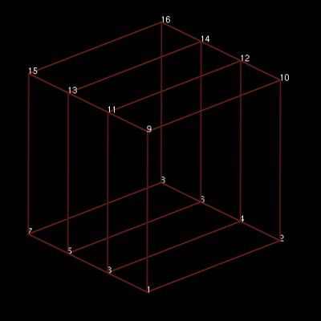

================
Laplace Equation
================

This example solves the weak form of the standard Laplace equation,

|laplace_equation|

where |conductivity_tensor| is the rank two conductivity tensor and |phi| is a scalar field (e.g. temperature), using the Galerkin Finite Element method. A homogeneous and isotropic material with |equation1| (identity tensor) is considered in this example. As a result, |conductivity_tensor| in the above equation becomes redundant and the equation reduces to

|laplace_equation2|.

Only Dirichlet boundary conditions are prescribed.

.. |conductivity_tensor| image:: ./images/conductivity_tensor.svg 
   :align: middle

   

   
Building the example
====================

The fortran version of the example can be configured and built with CMake::

  mkdir examples
  cd examples
  git clone https://github.com/OpenCMISS-Examples/laplace_equation
  cd laplace_equation
  cmake -DOpenCMISSLibs_DIR=/path/to/opencmisslib/install
  make

Running the example
===================

Fortran version::

  cd src/fortran
  ./laplace_equation

Python version::

  source /path/to/opencmisslibs/install/virtaul_environments/oclibs_venv_pyXY_release/bin/activate
  python src/python/XXXXXXXX.py

where the XY in the path are the Python major and minor versions respectively.

The results can be visualised by running `visualise.com <./src/fortran/visualise.com>`_ with the `Cmgui visualiser <http://physiomeproject.org/software/opencmiss/cmgui/download>`_.

The following figures show the finite element mesh (computational domain) and solution (scalar field variable, |phi|).  
 

    Figure 1. Finite element mesh 
    

    Figure 2. Field solution     
    
 
Prerequisites
=============

There are no additional input files required for this example as it is self-contained.

License
=======

License applicable to this example is described in `LICENSE <./LICENSE>`_.
