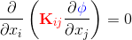
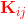
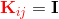

================
Laplace Equation
================

This example solves the standard Laplace equation of the form

|laplace_equation|.
    
where |conductivity_tensor| is the rank two conductivity tensor and |phi| is a scalar field (e.g. temperature). However, in this example an isotropic material with |equation1| (identity tensor) is considered.   

Building the example
====================

The fortran version of the example can be confiured and built with CMake::

  mkdir examples
  cd examples
  git clone https://github.com/OpenCMISS-Examples/laplace_equation
  cmake -DOpenCMISSLibs_DIR=/path/to/opencmisslib/install
  make

Running the example
===================

Explain how the example is run::

  ./src/fortran/laplace_equation

or maybe it is a Python only example::

  source /path/to/opencmisslibs/install/virtaul_environments/oclibs_venv_pyXY_release/bin/activate
  python src/python/XXXXXXXX.py

where the XY in the path are the Python major and minor versions respectively.

Prerequisites
=============

There are no additional input files required for this example as it is self-contained.

License
=======

License applicable to this example is described in `LICENSE <./LICENSE>`_.
